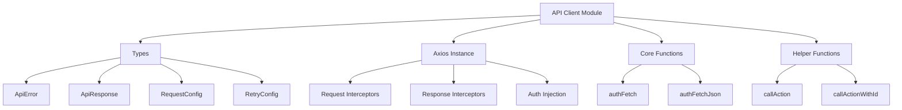

# API Client Refactor Plan

## Overview

This plan outlines the refactoring of the API utilities in the admin application to improve type safety, add interceptor support, request cancellation, and enhanced retry mechanisms while keeping axios as the underlying HTTP client.

## Current Implementation Analysis

### Files to Refactor
- [`api-client.ts`](apps/admin/src/shared/api/client/api-client.ts) - Core fetch functions
- [`helpers.ts`](apps/admin/src/shared/api/client/helpers.ts) - Action helper functions

### Current Functions
1. **`authFetch`** - Base authenticated fetch with retry support
2. **`authFetchJson`** - JSON wrapper for authFetch
3. **`callAction`** - Higher-order function for API calls
4. **`callActionWithId`** - Higher-order function for API calls with ID parameter

### Current Issues
- Uses `TData` generic parameter that should be removed
- Error handling is not type-safe (returns `error as any`)
- No centralized axios instance
- No interceptor support
- No request cancellation support
- Basic retry logic without exponential backoff
- Token management is coupled with the fetch logic

## Proposed Architecture



## Detailed Design

### 1. Type Definitions

```typescript
// types.ts

// Error types for type-safe error handling
export interface ApiErrorDetail {
  code?: string;
  message: string;
  field?: string;
}

export interface ApiError {
  status: number;
  statusText: string;
  message: string;
  details?: ApiErrorDetail[];
  timestamp?: string;
  path?: string;
}

// Response wrapper for type-safe responses
export interface ApiResponse<T> {
  data: T;
  status: number;
  statusText: string;
  headers: Record<string, string>;
}

// Retry configuration
export interface RetryConfig {
  enabled: boolean;
  maxRetries: number;
  retryDelay: number;
  retryOn: number[];
  exponentialBackoff: boolean;
}

// Request configuration extending AxiosRequestConfig
export interface RequestConfig extends Omit<AxiosRequestConfig, 'signal'> {
  skipAuth?: boolean;
  retry?: RetryConfig | boolean;
  signal?: AbortSignal;
}
```

### 2. Axios Instance with Interceptor Support

```typescript
// axios-instance.ts

import axios, { AxiosInstance, AxiosInterceptorOptions } from 'axios';

// Interceptor manager types
export interface InterceptorManager {
  request: {
    use: (onFulfilled?, onRejected?, options?: AxiosInterceptorOptions) => number;
    eject: (id: number) => void;
    clear: () => void;
  };
  response: {
    use: (onFulfilled?, onRejected?, options?: AxiosInterceptorOptions) => number;
    eject: (id: number) => void;
    clear: () => void;
  };
}

// Create axios instance with default config
function createAxiosInstance(): AxiosInstance {
  const instance = axios.create({
    timeout: 30000,
    headers: {
      'Content-Type': 'application/json',
    },
  });

  return instance;
}

// Export singleton instance
export const apiClient = createAxiosInstance();

// Export interceptor manager
export const interceptors: InterceptorManager = {
  request: {
    use: (onFulfilled, onRejected, options) => 
      apiClient.interceptors.request.use(onFulfilled, onRejected, options),
    eject: (id) => apiClient.interceptors.request.eject(id),
    clear: () => apiClient.interceptors.request.clear(),
  },
  response: {
    use: (onFulfilled, onRejected, options) => 
      apiClient.interceptors.response.use(onFulfilled, onRejected, options),
    eject: (id) => apiClient.interceptors.response.eject(id),
    clear: () => apiClient.interceptors.response.clear(),
  },
};
```

### 3. Request Cancellation Support

```typescript
// cancellation.ts

import { AxiosRequestConfig } from 'axios';

// Request cancellation manager
export class RequestCancellation {
  private controllers: Map<string, AbortController> = new Map();

  createRequestKey(url: string, method: string): string {
    return `${method}:${url}`;
  }

  createController(key: string): AbortController {
    this.cancel(key);
    const controller = new AbortController();
    this.controllers.set(key, controller);
    return controller;
  }

  cancel(key: string): void {
    const controller = this.controllers.get(key);
    if (controller) {
      controller.abort();
      this.controllers.delete(key);
    }
  }

  cancelAll(): void {
    this.controllers.forEach((controller) => controller.abort());
    this.controllers.clear();
  }

  getSignal(key: string): AbortSignal | undefined {
    return this.controllers.get(key)?.signal;
  }
}

export const requestCancellation = new RequestCancellation();
```

### 4. Retry Mechanism with Exponential Backoff

```typescript
// retry.ts

import { AxiosError } from 'axios';

const DEFAULT_RETRY_CONFIG: RetryConfig = {
  enabled: true,
  maxRetries: 2,
  retryDelay: 1000,
  retryOn: [408, 429, 500, 502, 503, 504],
  exponentialBackoff: true,
};

export function calculateRetryDelay(
  attempt: number,
  config: RetryConfig
): number {
  if (!config.exponentialBackoff) {
    return config.retryDelay;
  }
  // Exponential backoff: delay * 2^attempt with jitter
  const baseDelay = config.retryDelay * Math.pow(2, attempt);
  const jitter = Math.random() * 0.1 * baseDelay;
  return Math.min(baseDelay + jitter, 30000); // Cap at 30 seconds
}

export function shouldRetry(
  error: AxiosError,
  config: RetryConfig,
  attempt: number
): boolean {
  if (!config.enabled || attempt >= config.maxRetries) {
    return false;
  }

  const status = error.response?.status;
  return config.retryOn.includes(status ?? 0);
}

export async function sleep(ms: number): Promise<void> {
  return new Promise((resolve) => setTimeout(resolve, ms));
}
```

### 5. Core Functions Refactored

```typescript
// api-client.ts

import { AxiosResponse, AxiosError } from 'axios';
import { getAccessToken } from '@/shared/lib/auth/helpers/server-token';
import { refreshAccessToken } from '../../lib/auth/helpers/session';
import { apiClient, interceptors } from './axios-instance';
import { requestCancellation } from './cancellation';
import { calculateRetryDelay, shouldRetry, sleep, DEFAULT_RETRY_CONFIG } from './retry';

// Re-export types
export type { ApiError, ApiResponse, RequestConfig, RetryConfig } from './types';
export { interceptors, requestCancellation };

// Convert AxiosError to ApiError
function toApiError(error: AxiosError): ApiError {
  const responseData = error.response?.data as any;
  
  return {
    status: error.response?.status ?? 0,
    statusText: error.response?.statusText ?? 'Unknown Error',
    message: responseData?.message ?? error.message ?? 'An unexpected error occurred',
    details: responseData?.details ?? responseData?.errors,
    timestamp: responseData?.timestamp,
    path: responseData?.path ?? error.config?.url,
  };
}

// Main authFetch function
export async function authFetch<T = unknown>(
  url: string,
  config: RequestConfig = {}
): Promise<ApiResponse<T>> {
  const {
    skipAuth = false,
    retry = true,
    signal: externalSignal,
    ...axiosConfig
  } = config;

  const retryConfig = typeof retry === 'boolean' 
    ? { ...DEFAULT_RETRY_CONFIG, enabled: retry }
    : { ...DEFAULT_RETRY_CONFIG, ...retry, enabled: true };

  let attempt = 0;
  let lastError: ApiError | null = null;

  while (attempt <= retryConfig.maxRetries) {
    try {
      // Get access token if needed
      let accessToken: string | null = null;
      if (!skipAuth) {
        accessToken = await getAccessToken();
      }

      // Prepare headers
      const headers: Record<string, string> = {
        ...axiosConfig.headers,
      };

      if (accessToken && !skipAuth) {
        headers['Authorization'] = `Bearer ${accessToken}`;
      }

      // Make the request
      const response: AxiosResponse<T> = await apiClient.request<T>({
        url,
        ...axiosConfig,
        headers,
        signal: externalSignal,
        validateStatus: (status) => status < 500, // Don't throw on 4xx/5xx
      });

      // Handle 401 - try to refresh token
      if (response.status === 401 && retryConfig.enabled && !skipAuth) {
        const newAccessToken = await refreshAccessToken();
        if (newAccessToken) {
          // Retry with new token
          const retryResponse = await apiClient.request<T>({
            url,
            ...axiosConfig,
            headers: {
              ...headers,
              Authorization: `Bearer ${newAccessToken}`,
            },
            signal: externalSignal,
          });
          
          return {
            data: retryResponse.data,
            status: retryResponse.status,
            statusText: retryResponse.statusText,
            headers: retryResponse.headers as Record<string, string>,
          };
        }
      }

      // Check for error status
      if (response.status >= 400) {
        throw {
          response,
          isAxiosError: true,
        } as AxiosError;
      }

      return {
        data: response.data,
        status: response.status,
        statusText: response.statusText,
        headers: response.headers as Record<string, string>,
      };
    } catch (error: unknown) {
      const axiosError = error as AxiosError;
      
      // Handle cancellation
      if (axiosError.name === 'CanceledError' || axiosError.code === 'ERR_CANCELED') {
        throw new Error('Request was cancelled');
      }

      lastError = toApiError(axiosError);

      // Handle 401 with token refresh
      if (axiosError.response?.status === 401 && retryConfig.enabled && !skipAuth) {
        const newAccessToken = await refreshAccessToken();
        if (newAccessToken) {
          attempt++;
          continue;
        }
      }

      // Check if we should retry
      if (shouldRetry(axiosError, retryConfig, attempt)) {
        const delay = calculateRetryDelay(attempt, retryConfig);
        await sleep(delay);
        attempt++;
        continue;
      }

      throw lastError;
    }
  }

  throw lastError!;
}

// JSON wrapper
export async function authFetchJson<T>(
  url: string,
  config?: RequestConfig
): Promise<T> {
  const response = await authFetch<T>(url, config);
  return response.data;
}
```

### 6. Helper Functions Refactored

```typescript
// helpers.ts

import { authFetchJson, RequestConfig, ApiError } from './api-client';
import { env } from '@/shared/config';
import { CollectionQueryParams } from '../collection/types';
import { CollectionHelpers } from '../collection/helpers';

const apiEndpoint = env.NEXT_PUBLIC_API_ENDPOINT;

// Result type for type-safe error handling
export type Result<T, E = ApiError> = 
  | { success: true; data: T }
  | { success: false; error: E };

// Call action function
export function callAction<TReturn = void, TQuery extends CollectionQueryParams = CollectionQueryParams>(
  path: string,
  method: RequestConfig['method'],
  options?: Omit<RequestConfig, 'method' | 'data'>
) {
  return async (payload?: unknown, query?: TQuery): Promise<TReturn> => {
    const response = await authFetchJson<TReturn>(
      `${apiEndpoint}${path}${query ? `?${CollectionHelpers.paramsToQueryString(query)}` : ''}`,
      {
        ...options,
        method,
        data: payload,
      }
    );
    return response;
  };
}

// Call action with ID parameter
export function callActionWithId<TReturn = void, TQuery extends CollectionQueryParams = CollectionQueryParams>(
  path: string,
  method: RequestConfig['method'],
  options?: Omit<RequestConfig, 'method' | 'data'>
) {
  return async (resourceId: string, payload?: unknown, query?: TQuery): Promise<TReturn> => {
    const pathChunks = path.split('/');
    const pattern = pathChunks.find((chunk) => chunk.startsWith('{') && chunk.endsWith('}'));
    
    const resolvedPath = pattern ? path.replace(pattern, resourceId) : path;

    return authFetchJson<TReturn>(
      `${apiEndpoint}${resolvedPath}${query ? `?${CollectionHelpers.paramsToQueryString(query)}` : ''}`,
      {
        method,
        data: payload,
        ...options,
      }
    );
  };
}

// Safe version that returns Result type
export function callActionSafe<TReturn = void, TQuery extends CollectionQueryParams = CollectionQueryParams>(
  path: string,
  method: RequestConfig['method'],
  options?: Omit<RequestConfig, 'method' | 'data'>
) {
  return async (payload?: unknown, query?: TQuery): Promise<Result<TReturn>> => {
    try {
      const data = await authFetchJson<TReturn>(
        `${apiEndpoint}${path}${query ? `?${CollectionHelpers.paramsToQueryString(query)}` : ''}`,
        {
          ...options,
          method,
          data: payload,
        }
      );
      return { success: true, data };
    } catch (error) {
      return { success: false, error: error as ApiError };
    }
  };
}
```

## Migration Guide

### Before
```typescript
// Old usage with TData generic
const resp = await callAction<CreateProductInput, void | { error?: string }>(
  '/api/product',
  'POST'
)(payload);
```

### After
```typescript
// New usage - payload type is inferred, only return type needed
const resp = await callAction<void>(
  '/api/product',
  'POST'
)(payload);

// Or with safe version for type-safe error handling
const result = await callActionSafe<Product>(
  '/api/product',
  'POST'
)(payload);

if (result.success) {
  console.log(result.data);
} else {
  console.error(result.error.message);
}
```

### Using Interceptors
```typescript
import { interceptors } from '@/shared/api';

// Add request interceptor
const requestInterceptorId = interceptors.request.use(
  (config) => {
    console.log('Request:', config.url);
    return config;
  },
  (error) => Promise.reject(error)
);

// Add response interceptor
const responseInterceptorId = interceptors.response.use(
  (response) => {
    console.log('Response:', response.status);
    return response;
  },
  (error) => Promise.reject(error)
);

// Remove interceptor
interceptors.request.eject(requestInterceptorId);
```

### Using Request Cancellation
```typescript
import { requestCancellation, authFetch } from '@/shared/api';

// Create a cancellable request
async function fetchData() {
  const key = requestCancellation.createRequestKey('/api/products', 'GET');
  const controller = requestCancellation.createController(key);
  
  try {
    const response = await authFetch('/api/products', {
      method: 'GET',
      signal: controller.signal,
    });
    return response.data;
  } catch (error) {
    if (error.message === 'Request was cancelled') {
      console.log('Request was cancelled');
    }
    throw error;
  }
}

// Cancel the request
requestCancellation.cancel('GET:/api/products');

// Cancel all requests
requestCancellation.cancelAll();
```

### Using Retry Configuration
```typescript
import { authFetch } from '@/shared/api';

// Custom retry configuration
const response = await authFetch('/api/products', {
  method: 'GET',
  retry: {
    enabled: true,
    maxRetries: 3,
    retryDelay: 500,
    retryOn: [408, 429, 500, 502, 503, 504],
    exponentialBackoff: true,
  },
});

// Disable retry
const response = await authFetch('/api/products', {
  method: 'GET',
  retry: false,
});
```

## File Structure

```
apps/admin/src/shared/api/
├── client/
│   ├── api-client.ts      # Core fetch functions
│   ├── axios-instance.ts  # Axios instance and interceptor manager
│   ├── cancellation.ts    # Request cancellation utilities
│   ├── retry.ts           # Retry logic with exponential backoff
│   ├── types.ts           # Type definitions
│   └── helpers.ts         # callAction and callActionWithId
├── collection/
│   ├── helpers.ts
│   └── types.ts
├── actions/
│   └── image-medias-actions.ts
└── index.ts               # Public exports
```

## Implementation Checklist

- [ ] Create `types.ts` with all type definitions
- [ ] Create `axios-instance.ts` with interceptor support
- [ ] Create `cancellation.ts` with request cancellation
- [ ] Create `retry.ts` with exponential backoff logic
- [ ] Refactor `api-client.ts` with new features
- [ ] Refactor `helpers.ts` removing TData generic
- [ ] Update `index.ts` exports
- [ ] Update existing usages if needed
- [ ] Add documentation comments

## Breaking Changes

1. **`TData` generic removed** - The payload type is now inferred from the argument
2. **Error handling** - Errors are now typed as `ApiError` instead of `any`
3. **Return type** - `authFetch` now returns `ApiResponse<T>` instead of raw AxiosResponse

## Non-Breaking Changes

1. Token management utilities remain unchanged
2. Existing `callAction` and `callActionWithId` signatures are backward compatible (just remove TData)
3. Default behavior remains the same (retry enabled, 2 max retries)
