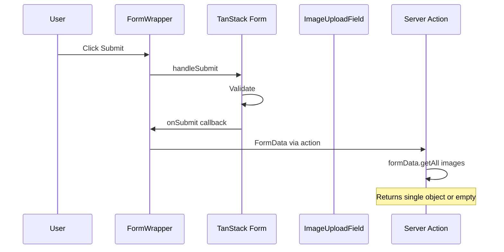
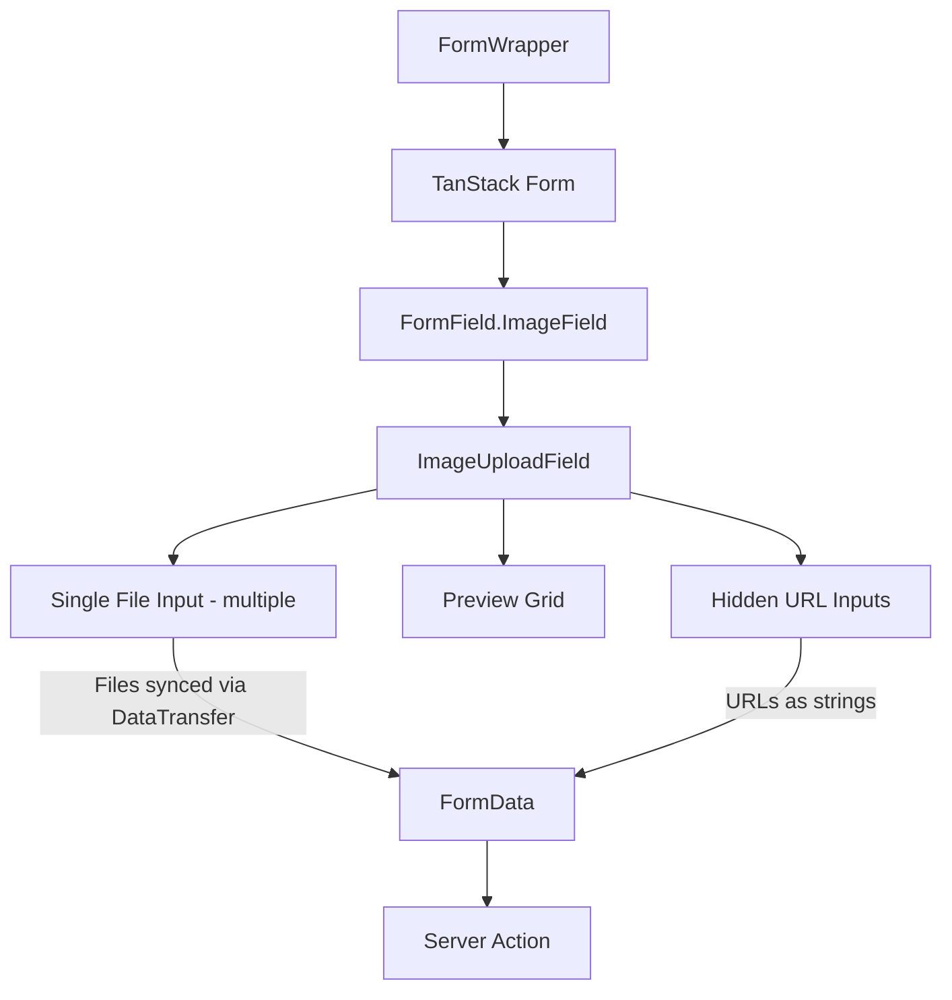

# Image Upload Component Fix Plan

## Problem Analysis

### Current Architecture Flow



### Root Cause

The issue is in how the form submission works with the current architecture:

1. **FormWrapper** uses `React.useActionState` with a server action
2. The form has `action={action}` pointing to the server action
3. On submit, `form.handleSubmit()` is called for TanStack Form validation
4. The native form submission sends FormData to the server action

**The Problem**: 
- The `files` property on `<input type="file">` is **read-only** and cannot be set programmatically
- Creating hidden file inputs with `files={...}` does NOT work - the files property is ignored
- Only files selected by the user through the native file picker are included in FormData

### Why the Current Approach Fails

```tsx
// This does NOT work - files property is read-only
<input
  type="file"
  name={name}
  files={(() => {
    const dt = new DataTransfer();
    dt.items.add(file);
    return dt.files;
  })()}
/>
```

The browser ignores the `files` attribute on file inputs because it's a security restriction. Files can only be added through user interaction.

## Solution Options

### Option 1: Intercept Form Submission and Manually Construct FormData

**Approach**: 
- Keep track of selected files in the component state
- Intercept the form submission event
- Manually construct FormData with all files before sending to server action

**Pros**:
- Full control over FormData
- Works with existing server action pattern

**Cons**:
- Requires modifying FormWrapper
- More complex implementation

### Option 2: Use a Single File Input with Multiple Attribute

**Approach**:
- Use a single visible `<input type="file" multiple />`
- Let the browser handle file selection naturally
- Files are automatically included in FormData

**Pros**:
- Simple, native browser behavior
- No need to manipulate FormData

**Cons**:
- Cannot pre-populate with existing files
- Cannot show previews before submission in the same way
- Limited control over the file list

### Option 3: Hybrid Approach - Recommended

**Approach**:
1. Use a single file input with `multiple` attribute for actual file submission
2. Track files in TanStack Form state for validation and preview
3. On file selection, update both the file input AND the form state
4. Use `DataTransfer` API to sync files to the single file input

**Key Insight**: The `DataTransfer` API CAN be used to set files on a file input, but only on a file input that exists in the DOM and is part of the form being submitted.

```tsx
// This WORKS - setting files via DataTransfer on an existing input
const input = fileInputRef.current;
const dt = new DataTransfer();
files.forEach(f => dt.items.add(f));
input.files = dt.files;
```

## Recommended Solution Architecture

### Component Structure



### Implementation Plan

1. **Modify ImageUploadField Component**:
   - Use a single `<input type="file" multiple />` with the field name
   - Sync selected files to this input using `DataTransfer` API
   - Render hidden inputs for existing URL strings
   - Track files in form state for validation/previews

2. **Key Implementation Details**:
   - The file input MUST have `name` attribute matching the field name
   - Files are synced to the input's `files` property via `DataTransfer`
   - Hidden inputs for URLs use the same name (FormData.getAll will retrieve both)

3. **Server Action Handling**:
   - Use `formData.getAll('images')` to get all values
   - Filter to separate File objects from string URLs
   - Process accordingly

### Code Changes Required

#### 1. ImageUploadField.tsx - Key Changes

```tsx
// Single file input that will be synced
<input
  ref={fileInputRef}
  name={name}  // Important: name matches field
  type="file"
  multiple={multiple}
  accept={accept}
  className="hidden"
  onChange={handleFileChange}
/>

// Sync files to input when items change
useEffect(() => {
  const input = fileInputRef.current;
  if (!input) return;
  
  const files = items.filter(isFile);
  const dt = new DataTransfer();
  files.forEach(f => dt.items.add(f));
  input.files = dt.files;
}, [items]);

// Hidden inputs for URLs
{urlItems.map((url, index) => (
  <input key={index} type="hidden" name={name} value={url} />
))}
```

#### 2. Server Action - Handle Both Files and URLs

```tsx
export const createProductAction = async (_prev: unknown, formData: FormData) => {
  const allImages = formData.getAll('images');
  
  const files = allImages.filter((item): item is File => item instanceof File);
  const urls = allImages.filter((item): item is string => typeof item === 'string');
  
  // Process files - upload them
  // Process URLs - they're already uploaded
};
```

## Testing Plan

1. **Unit Tests**:
   - Test file selection and preview generation
   - Test file removal
   - Test URL handling for existing images

2. **Integration Tests**:
   - Test form submission with multiple files
   - Test form submission with mix of files and URLs
   - Test validation errors

3. **Manual Testing**:
   - Select multiple images
   - Submit form
   - Verify server receives all files

## Migration Path

1. Create new `ImageUploadField` component with the fix
2. Keep existing `ImageUploadInput` unchanged
3. Update `FormField.ImageField` to use the new component
4. Update server actions to handle both files and URLs properly

## Summary

The key fix is ensuring that:
1. A single file input with `multiple` attribute is used for file submission
2. Files are synced to this input using the `DataTransfer` API (which works for setting files on existing inputs)
3. Hidden inputs are used for URL strings
4. Server action uses `formData.getAll()` to retrieve all values
